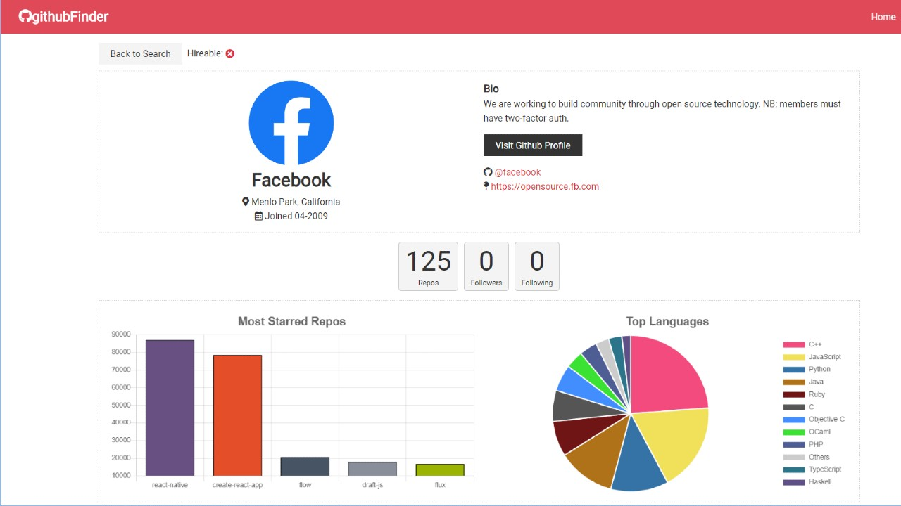

# Github Profile Viewer

View a simple and stylish overview of a user's github profile



## Setup

To clone and run this application, you'll need [Git](https://git-scm.com/) and [Node.js](https://nodejs.org/) (which comes with [npm](https://www.npmjs.com/)) installed on your computer. From your command line:

```sh
# Clone this repository
$ git clone https://github.com/andyrutherford/.git

# Go into the repository
$ cd

# Install dependencies
$ npm install

# Run the app
$ npm start
```

## Tech

- [ReactJS](https://reactjs.org/) - A JavaScript library for building user interfaces
- [axios](https://github.com/axios/axios) - Promise based HTTP client for the browser and node.js
- [Chart.js](https://www.chartjs.org/) - data visualization
- [Github API](https://developer.github.com/v3/)

## Demo

## License

MIT
